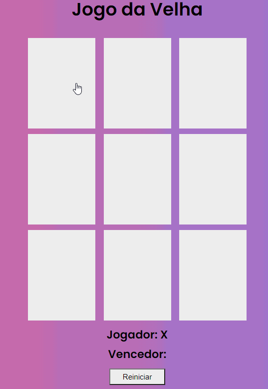

  

    
    </img>
  

### **Descrição** :
  
Construção de um jogo da velha, utilizando somente HTML para estruturar nosso site, CSS para estilizar e dar vida a ele, e Javascript para criarmos toda suas interações, desde a escolha do jogador, efetivar uma jogada e dar um vencedor ao jogo.

---

### Tecnologias:

- [HTML](https://developer.mozilla.org/en-US/docs/Glossary/HTML)
- [CSS](https://developer.mozilla.org/en-US/docs/Web/CSS)
- [JavaScript](https://developer.mozilla.org/en-US/docs/Web/JavaScript)
---
### Para jogar :

1. Clonar o repositório - `git clone`
2. Abra o  `index.html` via navegador 

---
<h3>Créditos :</h3>

- Vitor Ruschoni [GitHub](https://github.com/ruschoni02).

- Bootcamp [Digital Innovation One](https://digitalinnovation.one/).
---

|        [Erick F.](https://github.com/Nic-Developer)         |
| :---------------------------------------------------------: |
|  |
